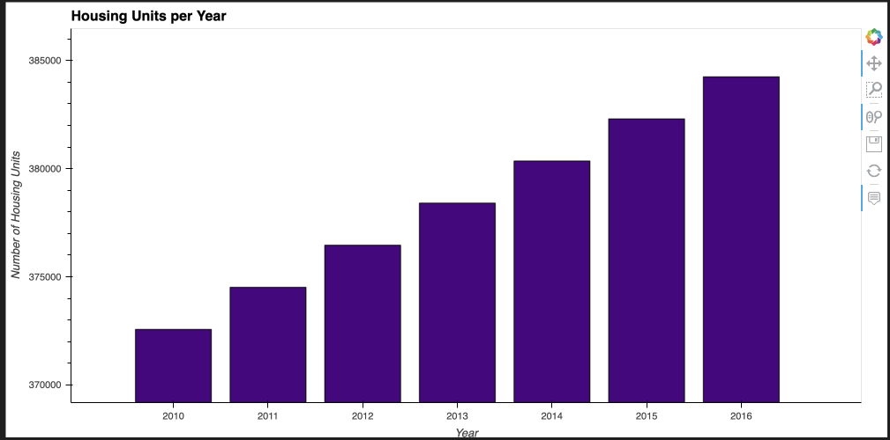
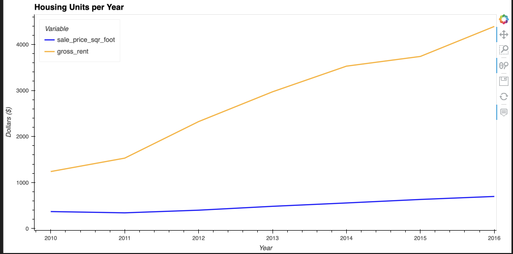
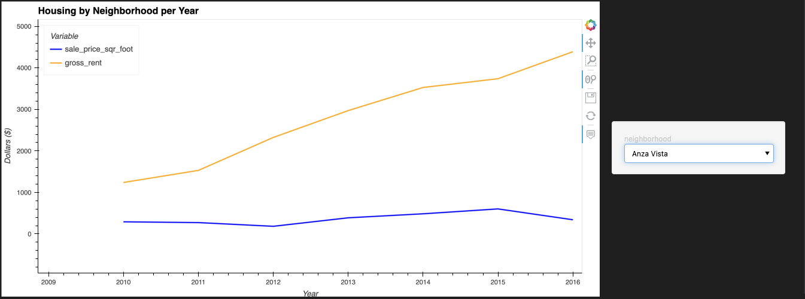
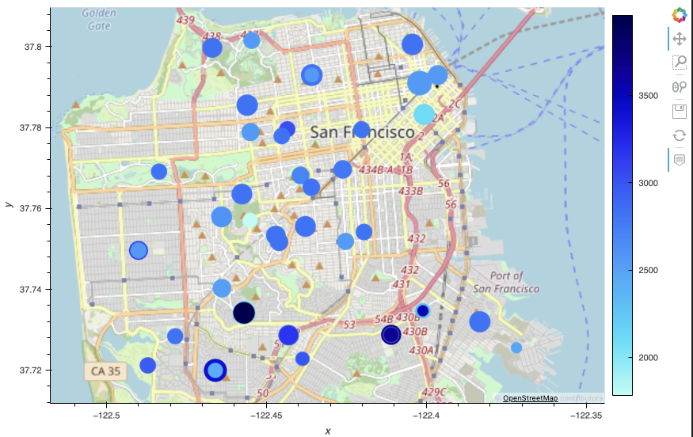

# Diamante Vistas, LLC
The Proptech Company For 🫵🏼

## Introduction
Our product offers the customer the ability to buy properties and then rent them via one-click. In the end the customer will be able to narrow down a list of prospective neighborhoods to invest in. The property market under review is San Fransisco, California. Use the san_francisco_housing.ipynb to review the analysis and recommendations. There are comments thoughout the notebook providing details on each step.

## Objective
The following analysis will be provided:
  1. Review and visualization of the overall trend in housing units per year;
  2. Review and visualization of the average sale prices by neighborhoods;
  3. Mapping of via Geoviews;
  4. Recommendations of where to invest for buying and renting properties in San Franscisco, California.

      ** Please note that in running the jupyter notebook hvplot visuals may have a delay and restarting the kernel may be needed.
## Results

### 1. Housing Units Per Year

### 2. Sale Price per Sqft vs. Gross Rent

### 3. Sale Price per Sqft vs. Gross Rent filter by Anza

### 4. Geoview Mapping - Sales Price per Sqft to Gross Rent

## Credits
 - UC Berkeley Fintech Bootcamp
 - Hvplot https://hvplot.holoviz.org/user_guide.html
 - US Census Data 

## Resources
- housing_per_year.csv
- neighborhoods_coordinates.csv
- sfo_neighborhoods_census_data.csv
- housing_units_per_year.png
- Sale_price_per_sqft_vs_gross_rent.png
- Anza_filter_line.png
- Geoview_mapping.png

## Images
- 6-4-challenge-image.png
  
## License
Copyright © 2023 Diamente Vistas, LLC
Edward N. Arnold II, PsyD.
